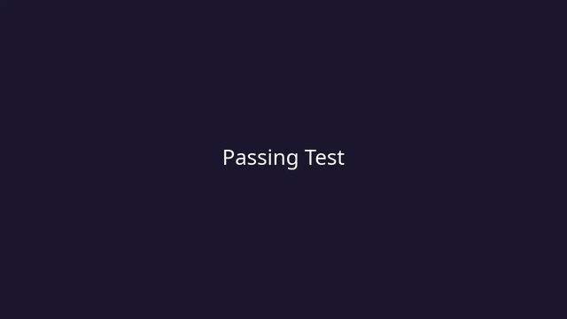

# check_cep Tutorial



This tutorial walks you through building the container image, writing your first
Playwright test, and running it with `check_cep`.

## Prerequisites

- **Podman** installed and working (rootless mode is fine)
- **Python 3** on the host (for `check_cep` itself)
- Internet access (to pull the base image and for tests to reach target websites)

### Rootless Podman Setup for OMD Site Users

---

#### Quick Setup (copy & paste)

Run all of this as **root**, then open a fresh SSH session as the site user:

```bash
# 1. Subordinate UID/GID ranges — lets Podman create user namespaces
usermod --add-subuids 100000-165535 --add-subgids 100000-165535 cep

# 2. Linger — keeps the systemd user session alive without a login
loginctl enable-linger cep

# 3. Delegate the io cgroup controller — required for I/O metrics
mkdir -p /etc/systemd/system/user@.service.d
cat > /etc/systemd/system/user@.service.d/delegate.conf << 'EOF'
[Service]
Delegate=cpu cpuset io memory pids
EOF
systemctl daemon-reload
systemctl restart user@$(id -u cep).service
```

Quick sanity check:

```bash
grep -q io /sys/fs/cgroup/user.slice/cgroup.subtree_control && echo "io: OK" || echo "io: MISSING"
```

Then log in as `cep` in a **new SSH session** (not `su`) and run a test check.

> **Want to understand *why* each step is needed?** See [Appendix A — Rootless
> Podman Internals](#appendix-a--rootless-podman-internals) at the end of this
> document for a deep dive into user namespaces, systemd linger, and cgroup
> controller delegation.

---

## 1. Build the Container Image

The image is built from the `src/` directory. You must pass the Playwright version
as a build argument. The version determines which Microsoft Playwright base image
is used.

```bash
cd src/
podman build \
  --build-arg PLAYWRIGHT_VERSION=v1.58.2 \
  -t localhost/check_cep:latest .
```

This takes a few minutes on the first run (downloading browsers). Subsequent
builds are fast thanks to layer caching.

### Custom npm Dependencies

If your tests need additional npm packages (e.g. `@axe-core/playwright`), replace
the zero-byte `src/package.json` and `src/package-lock.json` with real ones before
building. The Dockerfile detects a non-empty `package-lock.json` and runs `npm ci`
automatically.

## 2. Prepare Test Files

Create a directory for your test. The directory needs at minimum:

- `playwright.config.ts` — Playwright configuration
- `tests/` subdirectory — containing one or more `*.test.ts` files

### Example: Testing consol.de

```bash
mkdir -p /tmp/my-first-test/tests
```

Create the Playwright config:

```bash
cat > /tmp/my-first-test/playwright.config.ts << 'EOF'
import { defineConfig } from '@playwright/test';

export default defineConfig({
  testDir: './tests',
  timeout: 30000,
  use: {
    headless: true,
    viewport: { width: 1280, height: 720 },
  },
  projects: [
    { name: 'chromium', use: { browserName: 'chromium' } },
  ],
});
EOF
```

Create a test file:

```bash
cat > /tmp/my-first-test/tests/consol.test.ts << 'EOF'
import { test, expect } from '@playwright/test';

test('consol.de has Consulting & Solutions', async ({ page }) => {
  await page.goto('https://www.consol.de');
  await expect(page.locator('body')).toContainText('Consulting & Solutions');
});
EOF
```

### Directory Layout

Your test directory should look like this:

```
/tmp/my-first-test/
  playwright.config.ts
  tests/
    consol.test.ts
```

You can have multiple test files, helper modules, and fixture files. Playwright
discovers all `*.test.ts` / `*.test.js` files under the configured `testDir`.

## 3. Run the Test

```bash
python3 src/check_cep \
  --host-name testhost \
  --service-description Consol_Homepage \
  --image localhost/check_cep:latest \
  --probe-location local \
  --test-source local \
  --result-dest local \
  --test-dir /tmp/my-first-test \
  --result-dir /tmp/my-first-results \
  --timeout 60
```

### What Happens

1. `check_cep` creates the result directory (`/tmp/my-first-results`)
2. It starts a Podman container with:
   - your test directory mounted read-only at `/home/pwuser/tests`
   - the result directory mounted read-write at `/home/pwuser/results`
3. Inside the container, `run.py` runs `npx playwright test`
4. Playwright writes `steps.json`, an HTML report, and (on failure) screenshots
5. The container fixes result file ownership (see below)
6. `check_cep` reads the results and prints a Nagios status line

### Expected Output (passing test)

```
OK - test Consol_Homepage succeeded | 'TestDuration'=1250ms 'duration'=5s 'podman_cpu_usage'=6.79s ...
```

### Expected Output (failing test)

```
CRITICAL - test Consol_Homepage failed | 'duration'=4s ...
```

The exit code follows Nagios conventions:

| Exit Code | Meaning |
|-----------|---------|
| 0         | OK — all tests passed |
| 1         | WARNING — tests passed but stderr was found |
| 2         | CRITICAL — test failure, timeout, or OOM |
| 3         | UNKNOWN — configuration error, missing files |

## 4. Inspect the Results

After a run, the result directory contains:

```
/tmp/my-first-results/
  steps.json              # Structured test results (durations, errors, stdout/stderr)
  test-meta.json          # Runtime metadata (hostname, status, duration, timestamp)
  playwright-report/
    index.html            # Interactive HTML report — open in a browser
  test-results/           # Screenshots and traces (on failure)
```

All files are owned by the user who called `check_cep` — not by a container
internal uid. See [File Ownership](#file-ownership-in-local-mode) below for
details.

### View the HTML Report

```bash
xdg-open /tmp/my-first-results/playwright-report/index.html
# or on macOS:
open /tmp/my-first-results/playwright-report/index.html
```

### Inspect test-meta.json

```bash
cat /tmp/my-first-results/test-meta.json
```

```json
{
    "timestamp": "1772635413",
    "hostname": "testhost",
    "servicedescription": "Consol_Homepage",
    "exitcode": 0,
    "duration": "6.513",
    "probe_location": "local",
    "status": "OK"
}
```

### Inspect steps.json

`steps.json` contains the full Playwright JSON reporter output — test durations,
individual step timings, stdout, stderr, and error messages. This is the primary
data source for the performance data (`'TestDuration'=...`) in the Nagios output.

## 5. File Ownership in Local Mode

When `--result-dest local` is used, Podman mounts the result directory into the
container. Playwright runs as `pwuser` (a non-root user inside the image), so all
written files initially appear on the **host** owned by an unpredictable sub-uid
— typically a large number like `525287` — that is not your user:

```
-rw-r--r--. 1 525287 525287 2615 Mar  4 16:44 steps.json   ← hard to delete!
```

`check_cep` solves this automatically. Before the container exits,
`dest_local.py` runs:

```bash
sudo chown -R root:root ~/results
sudo chmod -R u+rwX,go+rX ~/results
```

**Why `chown root` works**: in rootless Podman, `root` inside the container maps
exactly to the uid of the user who invoked `podman run` on the host. So `chown
root` from inside the container transfers ownership to your user outside it.

After a successful run, result files are owned normally:

```
-rw-r--r--. 1 yourusername yourusername 2615 Mar  4 17:02 steps.json
```

This requires `pwuser` to have passwordless `sudo`, which the Dockerfile
configures via `/etc/sudoers.d/pwuser`.

## 7. Debug a Failing Test

### Add `--debug` for Verbose Logging

```bash
python3 src/check_cep \
  --host-name testhost \
  --service-description Consol_Homepage \
  --image localhost/check_cep:latest \
  --probe-location local \
  --test-source local \
  --result-dest local \
  --test-dir /tmp/my-first-test \
  --result-dir /tmp/my-first-results \
  --timeout 60 \
  --debug
```

This shows the full `podman run` command and container debug output.

### Use `--shell` to Enter the Container

```bash
python3 src/check_cep \
  --host-name testhost \
  --service-description Consol_Homepage \
  --image localhost/check_cep:latest \
  --probe-location local \
  --test-source local \
  --result-dest local \
  --test-dir /tmp/my-first-test \
  --result-dir /tmp/my-first-results \
  --timeout 60 \
  --shell
```

This drops you into a bash shell inside the container. From there you can run
Playwright manually:

```bash
cd ~/tests
npx playwright test --reporter=line
```

## 8. Headed Mode — Watch Tests Live on Your Desktop

When a test fails and the HTML report doesn't tell the whole story, you can watch
Playwright drive a real browser window on your desktop. The `--headed` flag
forwards the display connection from the container to your host.

### Prerequisites

- A **Linux desktop session** (KDE Plasma, GNOME, Xfce, etc.)
- **Wayland** (modern default on Fedora, Ubuntu 22.04+, KDE 6): works out of the
  box — `check_cep` auto-detects `WAYLAND_DISPLAY` and mounts the Wayland socket
- **X11**: needs `xhost` installed (usually part of `xorg-x11-server-utils` or
  `x11-xserver-utils`) and the `DISPLAY` variable set

`check_cep` auto-detects which display server is active and configures the
container accordingly. Wayland is preferred when both are available.

### Watch a Test Run

```bash
python3 src/check_cep \
  --headed \
  --host-name testhost \
  --service-description Consol_Homepage \
  --image localhost/check_cep:latest \
  --probe-location local \
  --test-source local \
  --result-dest local \
  --test-dir /tmp/my-first-test \
  --result-dir /tmp/my-first-results \
  --timeout 60
```

A Chromium window opens on your desktop, navigates to the target site, and you
can watch every click and assertion happen in real time. When the test finishes,
the window closes and `check_cep` produces its normal Nagios output.

> **Tip**: If your test runs too fast to follow, add `slowMo` to your
> `playwright.config.ts` to insert a delay between each Playwright action:
>
> ```typescript
> export default defineConfig({
>   use: {
>     launchOptions: {
>       slowMo: 500,   // 500ms pause between each action
>     },
>   },
> });
> ```

### Interactive Test Development with `--headed --shell`

The most powerful debug workflow: `--headed --shell` drops you into a bash shell
inside the container with the display connection already configured. Your test
directory is mounted at `~/tests` and a visible browser is available. This lets
you run tests manually, re-run individual tests, tweak selectors, and use the
Playwright UI tools — all while watching what happens in the browser.

```bash
python3 src/check_cep \
  --headed --shell \
  --host-name testhost \
  --service-description Consol_Homepage \
  --image localhost/check_cep:latest \
  --probe-location local \
  --test-source local \
  --result-dest local \
  --test-dir /tmp/my-first-test \
  --result-dir /tmp/my-first-results \
  --timeout 300
```

Once inside the container shell:

```bash
# Run all tests with a visible browser
cd ~/tests
npx playwright test --headed --reporter=line

# Run a single test by name
npx playwright test --headed -g "has title"

# Step-through debugging with Playwright Inspector
# (opens a second window with pause/resume/step controls)
npx playwright test --headed --debug

# Open the Playwright Test Generator (codegen)
# Records your clicks and generates test code automatically
npx playwright codegen https://www.example.com
```

The **Playwright Test Generator** (`codegen`) is especially useful for writing
new tests: it opens a browser and a code panel side by side. As you click
through the website, it records your actions as Playwright test code that you
can copy into a `.test.ts` file.

### How It Works

`check_cep` auto-detects the display server and configures the container:

**Wayland sessions** (modern default):

| Container setting | Purpose |
|-------------------|---------|
| `--volume $XDG_RUNTIME_DIR/wayland-0:…:ro` | Mounts the Wayland compositor socket into the container |
| `--env WAYLAND_DISPLAY=wayland-0` | Tells Chromium where to find the Wayland socket |
| `--env XDG_RUNTIME_DIR=/run/user/1001` | Points to the mounted socket directory |
| `--env PLAYWRIGHT_BROWSER_ARGS=…` | Injects `--enable-features=UseOzonePlatform --ozone-platform=wayland` so Chromium uses native Wayland rendering |

**X11 sessions** (fallback):

| Container setting | Purpose |
|-------------------|---------|
| `--volume /tmp/.X11-unix:/tmp/.X11-unix:ro` | Mounts the X11 unix socket |
| `--env DISPLAY=$DISPLAY` | Tells the browser which X display to connect to |
| `--volume ~/.Xauthority:/tmp/.Xauthority:ro` | X11 authentication cookie (if the file exists) |

Both modes also add:

| Container setting | Purpose |
|-------------------|---------|
| `--userns=keep-id:uid=1001,gid=1001` | Maps your host UID to `pwuser` inside the container, so the process can access the display socket |
| `--security-opt label=disable` | Disables SELinux labeling — the display socket cannot use `:z` relabeling since it's shared with the host |
| `--ipc=host` | Shares the host IPC namespace — Chromium uses MIT-SHM for fast rendering |

> **Note on Chromium vs Chrome**: The browser you see is **Chromium** (blue icon),
> not Google Chrome (multicolor icon). Playwright bundles its own Chromium build —
> it does not use your system browser. This is by design and ensures consistent
> test behavior.

### Browser Args Injection

When `PLAYWRIGHT_BROWSER_ARGS` is set by the host (e.g. with the Wayland Ozone
flags), the container generates a thin config wrapper (`_headed_config.ts` in the
results directory) that extends the user's `playwright.config.ts` and appends the
extra Chromium launch arguments. This means your test configs do not need any
display-specific flags — the container handles it transparently.

### File Ownership in Headed Mode

In headed mode, `--userns=keep-id` maps your host UID directly to `pwuser`
inside the container. Files written by `pwuser` already appear on the host with
your ownership — no `chown` needed. This differs from normal (headless) mode
where `chown root:root` inside the container transfers ownership to the host
user (see [File Ownership](#5-file-ownership-in-local-mode)).

### Error Messages

If the environment doesn't support headed mode, `check_cep` exits UNKNOWN:

| Message | Fix |
|---------|-----|
| `--headed requires WAYLAND_DISPLAY or DISPLAY to be set` | Run from a desktop terminal, not an SSH session |
| `--headed: X11 socket /tmp/.X11-unix/X0 not found` | Your X server isn't running; log in to a graphical desktop |
| `--headed requires xhost to be installed (X11 mode)` | Install `xorg-x11-server-utils` (Fedora) or `x11-xserver-utils` (Debian) |

### When to Use Headed Mode (and When Not To)

**Good uses:**
- Debugging a flaky test — watch what happens visually
- Writing a new test — iterate with `--headed --shell` and `playwright codegen`
- Investigating timing issues — see if the page loaded before the assertion ran
- Step-through debugging with Playwright Inspector (`--debug`)
- Cookie consent banners and popups — see what's blocking your selectors

**Not appropriate for:**
- Production monitoring (headless is the default for a reason)
- CI pipelines (no display)
- Automated test runs (adds overhead and requires a desktop session)

> **Next step — writing your own tests**: For advanced test authoring
> including the `check-cep-vision` API, persistent template images,
> regions, click offsets, and choosing between DOM and vision selectors,
> see [WRITING-TESTS.md](WRITING-TESTS.md).

## 9. OMD Integration

In a production OMD environment, the default paths are:

| Path | Purpose |
|------|---------|
| `$OMD_ROOT/etc/check_cep/tests/<HOSTNAME>/<SERVICE>/` | Test scripts |
| `$OMD_ROOT/var/tmp/check_cep/<HOSTNAME>/<SERVICE>/` | Results |

Both support `%h` (hostname) and `%s` (service description) template variables.

### Naemon Service Definition

```
define service {
    host_name               webserver01
    service_description     E2E_Login_Check
    check_command           check_cep!localhost/check_cep:latest!datacenter-eu
    ...
}

define command {
    command_name    check_cep
    command_line    $OMD_ROOT/local/lib/nagios/plugins/check_cep \
                    --host-name '$HOSTNAME$' \
                    --service-description '$SERVICEDESC$' \
                    --image '$ARG1$' \
                    --probe-location '$ARG2$' \
                    --test-source local \
                    --result-dest local
}
```

This runs the tests at `$OMD_ROOT/etc/check_cep/tests/webserver01/E2E_Login_Check/`
and writes results to `$OMD_ROOT/var/tmp/check_cep/webserver01/E2E_Login_Check/`.

## 10. CLI Reference

### Required Arguments

| Argument | Description |
|----------|-------------|
| `--host-name` | Naemon `$HOSTNAME$` macro |
| `--service-description` | Naemon `$SERVICEDESC$` macro |
| `--image` | Container image name with tag |
| `--probe-location` | Geographic location identifier |

### Common Options

| Argument | Default | Description |
|----------|---------|-------------|
| `--test-source` | `local` | `local` or `s3` |
| `--result-dest` | `local` | `local` or `s3` |
| `--logging` | `none` | `none` or `loki` |
| `--test-dir` | `$OMD_ROOT/etc/check_cep/tests/%h/%s` | Host-side test directory |
| `--result-dir` | `$OMD_ROOT/var/tmp/check_cep/%h/%s` | Host-side result directory |
| `--timeout` | `60` | Container timeout in seconds |
| `--memory-limit` | `2g` | Container memory limit |
| `--debug` | off | Verbose logging |
| `--shell` | off | Interactive bash shell |
| `--headed` | off | Headed browser on your desktop (Wayland/X11 auto-detected, debug only) |

### Performance Data

Each successful run produces by default these metrics in the Nagios perfdata:

| Metric | Unit | Description |
|--------|------|-------------|
| `TestDuration` | ms | Playwright test execution time |
| `duration` | s | Total wall-clock time |
| `podman_cpu_usage` | s | Total CPU seconds consumed |
| `podman_peak_cpu` | % | Peak CPU utilization |
| `podman_memory_current` | B | Memory at container exit |
| `podman_memory_peak` | B | Peak memory usage |
| `podman_io_bytes_read` | B | Disk I/O read |
| `podman_io_bytes_write` | B | Disk I/O written |
| `podman_oom_killed` | 0/1 | Whether the container was OOM-killed |

Using Playwright's `test.step()` to group actions in your test produces
additional per-step duration metrics automatically.  See
[WRITING-TESTS.md](WRITING-TESTS.md#structuring-tests-with-teststep)
for details.

---

## 11. Testing the check_cep Plugin Itself

> **Scope clarification** — This section is about testing the software in **this
> repository** (the `check_cep` plugin and its supporting Python code). It is
> completely separate from the primary purpose of check_cep, which is to run
> Playwright end-to-end browser tests against your own websites and services.
> If you are looking for how to write E2E tests for a website, see sections 2–4
> above.

### What Is Tested

The integration test suite in `tests/` verifies that check_cep itself behaves
correctly under a range of conditions:

| Test file | What it covers |
|-----------|----------------|
| `test_check_cep.py` | Core scenarios: passing test, failing test, timeout, syntax error, perfdata, result files |
| `test_modes.py` | Five fixture files × local mode and S3 mode (parametrized) |
| `test_collision.py` | Concurrent duplicate run is blocked within seconds |
| `test_loki.py` | Loki log forwarding: entry received; dead endpoint is non-fatal |

The five Playwright fixtures used by `test_modes.py` live in `tests/fixtures/`
and target `https://practice.expandtesting.com/` — a public site designed for
end-to-end test practice. They exercise a passing scenario (`tc_pass`), a
registration flow (`tc_register_pass`), a deliberate failure (`tc_fail`), a
hang/timeout (`tc_timeout`), and a TypeScript syntax error (`tc_syntax`).

### Prerequisites

- **Podman** installed and working (rootless)
- **Python 3.9+** with `pytest` (`pip install pytest`)
- **For S3 and Loki tests only**: `podman-compose` and `boto3`
  (`pip install podman-compose boto3`)
- **Internet access** for `tc_pass` and `tc_register_pass` fixture tests

### Makefile Targets

A `Makefile` at the repository root provides convenient entry points:

```bash
make help          # Show all available targets
make image         # Build production image (localhost/check_cep:latest + version tag)
make test-image    # Build check_cep:test image (for development iteration)
make test-local    # Build test image + run tests without external services
make test-all      # Build test image + run full suite including S3 and Loki tests
make test-clean    # Stop and remove the MinIO + Loki compose stack
```

### Quick Start: Local-Only Tests

```bash
# Run local-mode tests — no MinIO, no Loki required
# (automatically builds check_cep:test if src/container/ changed)
make test-local
```

This runs `SKIP_INTEGRATION=1 pytest tests/integration/ -v`, which covers all
of `test_check_cep.py`, all `test_local[*]` cases in `test_modes.py`, and
`test_collision.py`. S3 and Loki tests are automatically skipped.

Expected output (abridged):

```
tests/integration/test_check_cep.py::test_passing PASSED
tests/integration/test_check_cep.py::test_failing PASSED
...
tests/integration/test_modes.py::test_local[tc_pass] PASSED
tests/integration/test_modes.py::test_local[tc_register_pass] PASSED
tests/integration/test_modes.py::test_local[tc_fail] PASSED
tests/integration/test_modes.py::test_local[tc_timeout] PASSED
tests/integration/test_modes.py::test_local[tc_syntax] PASSED
tests/integration/test_collision.py::test_collision PASSED
```

### Full Suite: Including S3 and Loki

```bash
make test-all      # builds test image, starts compose stack, runs everything, tears down
```

`make test-all` runs `pytest tests/integration/ -v`. The session-scoped
`compose_stack` fixture starts MinIO and Loki automatically, waits for them to
become ready, creates the required buckets, runs all tests, and then tears down
the stack. No manual `podman-compose` invocation needed.

To leave the stack running between runs for faster iteration:

```bash
podman-compose -f tests/compose/docker-compose.yml up -d   # start once
pytest tests/integration/ -v                               # run tests repeatedly
make test-clean                                             # stop when done
```

### Overriding the Container Image

`make test-image` tags the image as `check_cep:test` — deliberately separate from
the production `localhost/check_cep:latest` so you can iterate on `run.py` or the
Dockerfile without affecting the production image.

```bash
# Use a specific image (e.g. a production build) instead of the test image
CEP_IMAGE=localhost/check_cep:latest make test-local
CEP_IMAGE=localhost/check_cep:latest make test-all
```

### Running a Single Test File or Case

```bash
pytest tests/integration/test_modes.py -v
pytest "tests/integration/test_modes.py::test_local[tc_fail]" -v
SKIP_INTEGRATION=1 pytest tests/integration/test_modes.py -k local -v
```

### Spectate Mode — Watch the Tests Live on Screen

Set `CEP_SPECTATE=1` to run the integration tests with visible browsers
on your desktop.  Every Playwright action is slowed down, and vision
highlight boxes linger so you can follow what is happening.

This requires a working X11 or Wayland display — either a local desktop
session or SSH with X11 forwarding (`ssh -X`).

```bash
# The nicest show — just the vision tests
CEP_SPECTATE=1 pytest tests/integration/test_modes.py -k "tc_vision and local" -v

# All local tests
CEP_SPECTATE=1 pytest tests/integration/test_modes.py -k local -v
```

You can tune the speed with environment variables:

```bash
# Slower — more time to watch each step
CEP_SLOW_MO=800 CEP_VISION_HIGHLIGHT_MS=3000 CEP_SPECTATE=1 pytest tests/integration/test_modes.py -k "tc_vision and local" -v

# Faster — just a quick glance
CEP_SLOW_MO=200 CEP_VISION_HIGHLIGHT_MS=1000 CEP_SPECTATE=1 pytest tests/integration/test_modes.py -k "tc_vision and local" -v
```

| Variable | Default (spectate) | Effect |
|----------|-------------------|--------|
| `CEP_SLOW_MO` | 400 | Milliseconds Playwright pauses between each action |
| `CEP_VISION_HIGHLIGHT_MS` | 2000 | How long the vision highlight box stays visible |

### Test Structure

```
tests/
├── conftest.py                    # Session fixtures: cep_image, compose_stack,
│                                  #   write_playwright_config
├── fixtures/                      # Playwright .test.ts files used as test inputs
│   ├── tc_pass/tc_pass.test.ts
│   ├── tc_register_pass/tc_register_pass.test.ts
│   ├── tc_fail/tc_fail.test.ts
│   ├── tc_timeout/tc_timeout.test.ts
│   └── tc_syntax/tc_syntax.test.ts
├── compose/
│   └── docker-compose.yml         # MinIO + Loki service definitions
└── integration/
    ├── conftest.py                 # Helpers: run_check_cep(), run_check_cep_s3(),
    │                               #   local_test_dir(), query_loki(), omd_env, test_env
    ├── test_check_cep.py           # Core scenario tests
    ├── test_modes.py               # Parametrized: 5 fixtures × {local, s3}
    ├── test_collision.py           # Concurrent duplicate detection
    └── test_loki.py                # Loki log forwarding
```

---

## Appendix A — Rootless Podman Internals

Three separate Linux subsystems must cooperate for rootless Podman to work
correctly as an OMD site user. Each prerequisite fixes a failure in a different
layer of the stack.

### 1. User namespaces and subordinate ID maps

Rootless Podman isolates containers using Linux user namespaces
(`clone(CLONE_NEWUSER)`). Inside the container, processes appear to run as a
range of UIDs (root at UID 0, `pwuser` at UID 1000, etc.). On the host these
map to a contiguous block of *subordinate* UIDs owned by the site user.

The kernel learns about this mapping from `/etc/subuid` and `/etc/subgid`.
`usermod --add-subuids` appends the entry. `newuidmap(1)` and `newgidmap(1)`
(setuid helpers, part of `shadow-utils`) then write the actual
`/proc/self/uid_map` inside the new namespace. Without a subuid entry the
kernel refuses the `uid_map` write and Podman aborts before the container
even starts.

The range `100000–165535` (65536 entries) is the conventional default. It is
wide enough to map a full 16-bit UID space inside the container and avoids
collisions with real system UIDs (< 1000) and typical user UIDs (1000–60000).

### 2. Systemd linger and the user session unit

Podman's cgroup v2 support relies on the *systemd user bus*
(`/run/user/UID/bus`), which is only available when `user@UID.service` is
running. Normally systemd starts this unit when the user opens a session and
stops it when the last session ends.

`loginctl enable-linger cep` creates a marker in `/var/lib/systemd/linger/`
that causes `systemd-logind` to start `user@UID.service` at boot and keep it
alive indefinitely — regardless of whether the user is logged in. Without
linger, a Naemon check running as `cep` via `sudo -u cep` or `su -s /bin/sh`
has no systemd session, Podman falls back to the raw `cgroupfs` driver, and
cgroup v2 resource tracking is unreliable.

### 3. Cgroup controller delegation and io.stat

This is the subtlest of the three. Cgroup v2 uses a *controller delegation*
model: a parent cgroup explicitly lists which resource controllers it passes
down to children by writing to `cgroup.subtree_control`. A controller that is
not listed there is simply absent from all descendant cgroups — the
corresponding pseudo-files (`io.stat`, `cpu.stat`, etc.) do not exist.

The delegation chain for the site user looks like this:

```
/sys/fs/cgroup/                         ← root cgroup (kernel-managed)
  └── user.slice/                        ← all user sessions
        └── user-999.slice/              ← sessions for uid 999 (cep)
              └── user@999.service/      ← the user manager itself
                    └── app.slice/       ← transient container cgroups land here
                          └── libpod-<ID>.scope/
```

Systemd reads `Delegate=` from the unit file and writes those controller names
into `cgroup.subtree_control` when it starts the unit. The stock
`user@.service` in most distributions ships with:

```
Delegate=pids memory cpu
```

This is intentionally conservative — `io` throttling interacts with the block
layer and can degrade I/O performance if misused, so upstream chose not to
delegate it by default.

The consequence: `io.stat` does not exist anywhere in the
`user-999.slice/` subtree, so `check_cep`'s cgroup polling thread finds no
file to read and sets `podman_metric_collection_failed=1`.

The drop-in `/etc/systemd/system/user@.service.d/delegate.conf` overrides the
`Delegate=` line for every user session on the host. After
`systemctl daemon-reload` + `systemctl restart user@999.service`, systemd
writes `cpuset cpu io memory pids` into
`/sys/fs/cgroup/user.slice/cgroup.subtree_control` and propagates it down the
slice tree, making `io.stat` available inside every container cgroup created
under that user session.

Note that `Delegate=` is *additive across drop-ins* only within a single
`[Service]` section — it does **not** merge with the base file. The drop-in
must therefore list the complete desired set, not just `io`.

`cpuset` is included so that Podman can honour CPU-pinning requests
(`--cpuset-cpus`); it is a no-op if unused.
